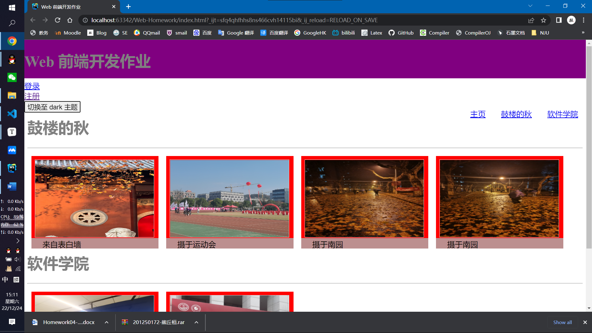
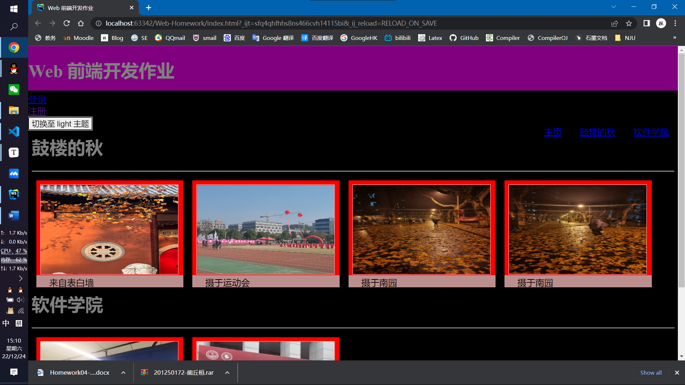

# Web 前端开发-作业 4

<center>熊丘桓 201250172

## 功能实现

实现点击按钮切换主题。





## 核心代码

核心代码在 `js/theme.js` 中：

```js
var dark = false;

function switchTheme() {
    if (dark === false) {
        document.body.style.backgroundColor = 'black';
        dark = true;
        document.getElementById('switchThemeButton').innerText = '切换至 light 主题';
    } else {
        document.body.style.backgroundColor = 'white';
        dark = false;
        document.getElementById('switchThemeButton').innerText = '切换至 dark 主题';
    }
}
```

