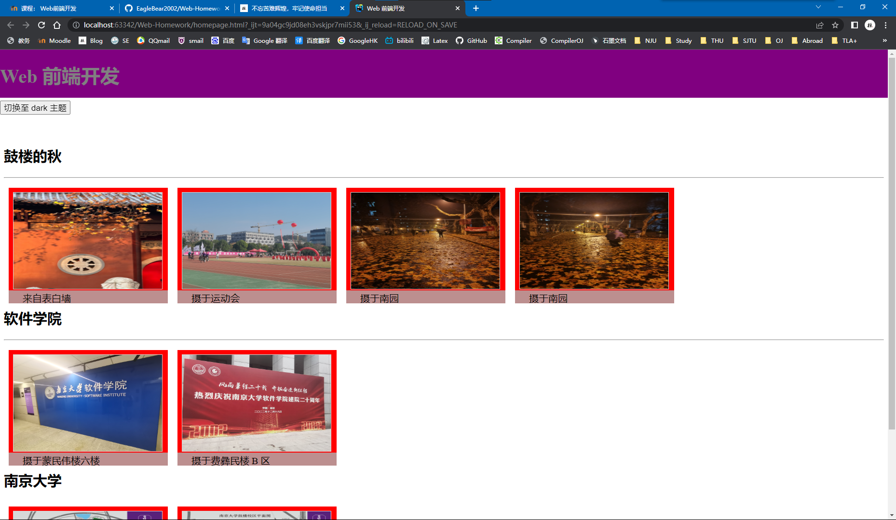
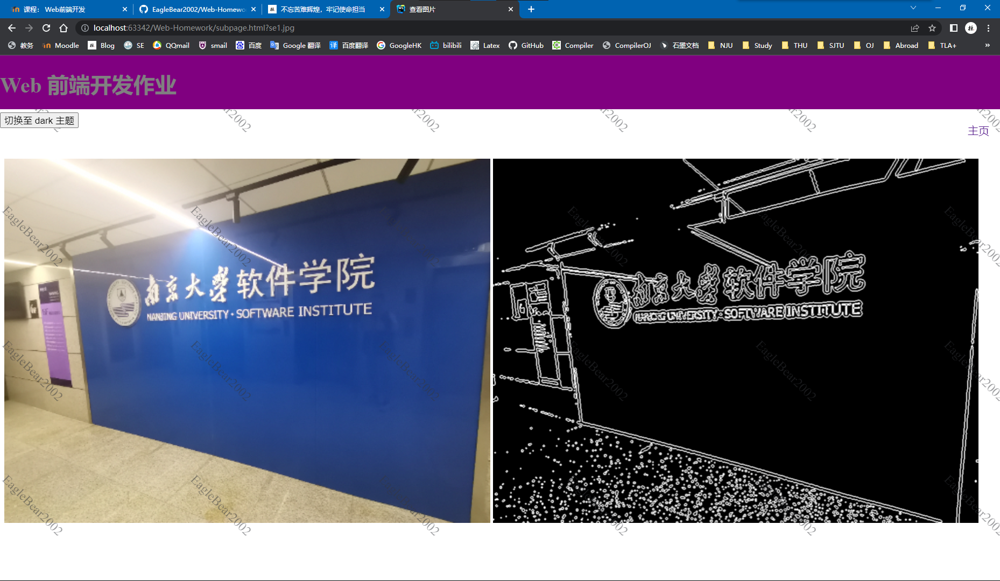
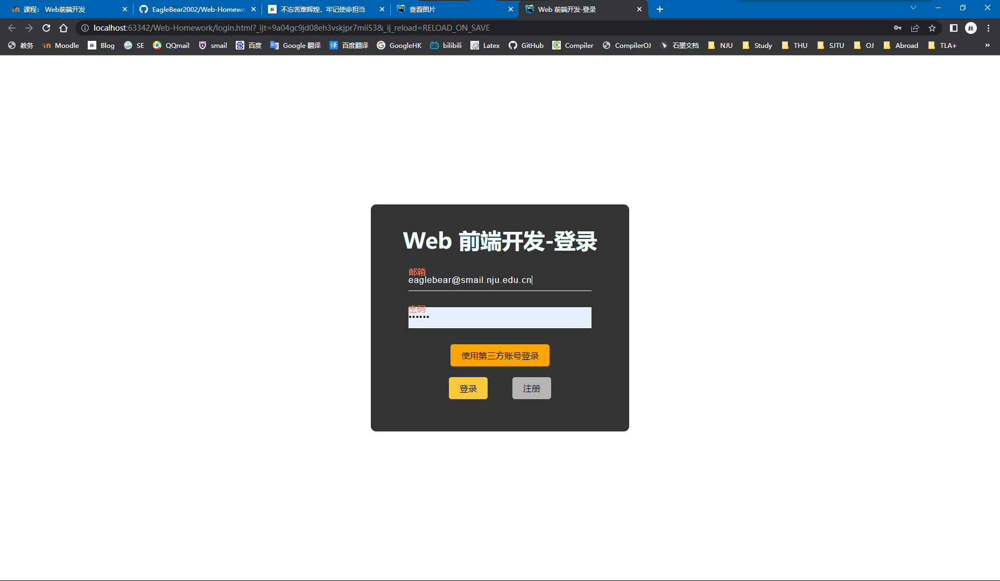
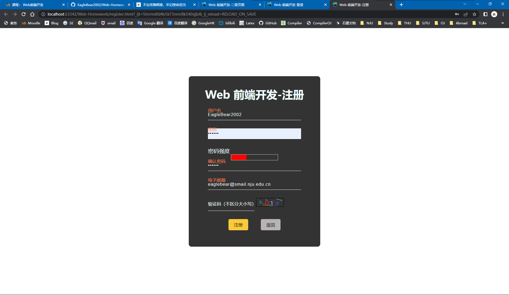

# 《Web 前端开发》课程作业

## 运行说明

本项目仅**使用最朴素的方式**实现了课程作业的**最低要求**，高端实现方式可参考**[NJUSE-21-Frontend](https://github.com/YDJSIR-NJU/NJUSE-21-Frontend)**。

1. 按照[数据库配置](#数据库配置)进行数据库配置；
2. 安装 Node.js：终端输入 `npm install`；
3. 终端输入`node server.js`，启动服务端；
4. 在 WebStorm 或浏览器中打开 `login.html` 以进入登录页面。

## 实现功能

### 注册

1. 使用 `node.js` 框架；
2. 使用本地 MySQL 数据库；
3. 可以使用邮箱注册/登录完成整体流程，第三方账号体现在登录界面；
4. 注册页面应使用正则表达式提示密码强度；
5. 登录页面可与一级页面结合，登陆后自动跳转到一级页面；
6. 使用 HTTP 基本鉴权。

***只有在登陆页面的邮箱和密码输入框为空时，才能够点击注册按钮进入注册页面。***

#### 用户名

不同邮箱注册的用户用户名允许重复。

#### 密码

##### 实现方案

笔者参考[浅谈密码强度规则的5个版本](https://www.woshipm.com/pd/595757.html) 中的常规版密码强度规则，实现了自己的密码强度规则：

1. 初始密码级别为 0；
2. 当密码包含小写字母时，密码级别加 1；
3. 当密码包含大写字母时，密码级别加 1；
4. 当密码包含数字时，密码级别加 1；
5. 当密码包含字母和数字以外的特殊字符时，密码级别加 1；
6. 当密码长度小于 6 时，密码级别为 0；
7. 密码强度最高为 3；
8. 密码级别为 0、1、2、3 分别对应不满足条件、弱、中、强。

##### 实现功能

1. 前端计算用户注册使用的的密码的密码强度；
2. 不满足其条件的密码无法通过注册；
3. 在注册过程中，密码强度等级使用不同颜色和长度的矩形来表示；
4. 如果两次输入的密码不同，网页提示：“密码不匹配”。

#### 电子邮箱注册

输入的电子邮箱必须是没有注册过的，否则会收到网页提示：“该邮箱已被注册”。

#### 验证码

##### 实现方案

笔者在前端使用 canvas 直接生成验证码，不使用后端接口，这种方法有有如下优点：

1. 减少后端接口的使用，减轻服务器负担；
2. 前端直接生成验证码，降低生成传输验证码的前后端通信开销。

这种方法还有如下缺点：

1. 用户可能会使用技术手段绕过前端生成的验证码，给系统造成安全风险。

##### 实现功能

1. 用户需要输入正确的验证码才能完成注册流程；
2. 点击验证码图片即可更换验证码；
3. 输入验证码错误会收到网页提示：“验证码错误”

#### 注册成功

成功注册账号，页面提示：“注册成功”并自动跳转至登陆页面。

### 登录

1. **一般的浏览器会自动填充被保存的用户名**，需要用户手动填入注册的**邮箱**；
2. 输入已经注册的邮箱地址和密码即可成功登录并自动跳转到一级页面；
3. 如果输入的邮箱未注册，网页提示：“邮箱不存在”；
4. 如果输入的密码与注册的密码不同，网页提示：“密码错误”。

### 动态可变水印

二级页面基于 svg 实现动态可变水印，水印内容为个人昵称。

### 傅里叶变换频域水印

基于傅里叶变换的频域不可见水印。

### 切换主题

主要在 `js/theme.js` 中实现。

点击按钮切换主题，包括 dark 主题和 light 主题。

### 图像卡通化处理

在二级页面基于 `opencv.js` 实现图像的卡通化处理，实现方式主要参考[OpenCV.js实现乔丹动图素描效果图文教程](https://www.jb51.net/article/257984.htm)。 

实现效果参考[二级页面](# 二级页面)。

## 数据库配置

### 数据库初始化

在本地 MySQL 数据库中进行如下初始化：

```sql
CREATE DATABASE IF NOT EXISTS WebProgramming CHARACTER SET UTF8;
USE WebProgramming;
DROP TABLE IF EXISTS `user`;
CREATE TABLE `user` (
	`email` varchar(64) NOT NULL,
	`name` varchar(64) NOT NULL,
	`password` varchar(64) NOT NULL,
	PRIMARY KEY (`email`)
) ENGINE=InnoDB DEFAULT CHARSET=utf8;
```

### 数据库连接

修改 `server.js` 中的 `connection` 变量定义部分以配置前端与数据库的连接；

```js
const connection = mysql.createConnection({
    host: '127.0.0.1',
    user: 'root',
    password: 'root',
    database: 'WebProgramming'
});
```

## 页面实现效果

### 主页

在 `homepage.html` 中实现；



### 二级页面

在`subpage.html` 中实现。



### 登录

在`login.html` 中实现。



### 注册

在`register.html` 中实现。



## 参考文献

1. [OpenCV.js实现乔丹动图素描效果图文教程](https://www.jb51.net/article/257984.htm) 
